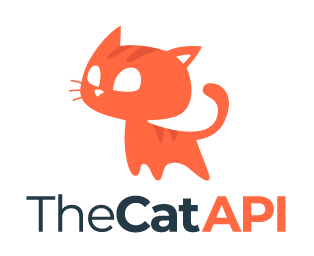

We at <a href="https://thatapicompany.com">ThatAPICompany</a> are both huge GeoSpatial and API nerds, after seeing the phenomenal work of the Overture Maps Foundation team we knew we had to help get both the word and their data out there. So we set about making an open source API to act as a wrapper around their data, and help developers of any skill level access the data in a simple and easy to use way.

This continues our mission to use APIs to make datasets widely available to developers, and to help them build amazing things with them that we started years ago with <a href="https://thecatapi.com">the Cat API</a> which together with it's sister site <a href="https://thedogapi.com">the Dog API</a> has helped millions of developers access and use pet data in their projects. We hope that the Overture Maps API will be just as successful and help developers build amazing things with GeoSpatial data.

[https://thecatapi.com](theCatAPI.com)

<!-- truncate -->