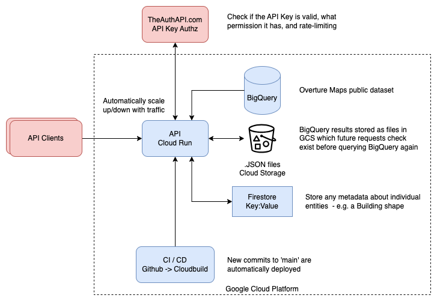

# Deploy to GCP (Google Cloud Platform)

Google hosts the Overture Maps dataset in it's public BigQuery dataset. This allows us to deploy the API to Google Cloud Platform (GCP) and take advantage of the free tier for hosting and querying the data. The $400 free credit is more than enough to get started and test the API. We can also use the free tier for Cloud Storage to cache the data for faster response times.

## Architecture

We can use the Cloud Run service to deploy the API. This allows us to scale the API based on demand and only pay for the resources we use. We can also use the Cloud Build service to automate the deployment process.

Results of Queries can be cached in Google Cloud Storage (GCS) to reduce the cost of querying the BigQuery dataset. The cache key (name of file) is an encoded version of the query string. The cache is set to expire by the bucket settings, and can be manually cleared if needed.

Firestore is used to cache metadata about individual entities as repeatably requesting these from BigQuery would be expensive e.g. Building shapes for Places by place.id.

In production you should consider migrating the parts of the dataset you need to a private BigQuery dataset or a different database for speed and cost, especially for building shapes.



## Setup Steps

- Create GCP Account with free credit
- Authenticate with GCP
- Create GCS bucket for cache (and set up lifecycle rules to delete old files after X days)
- Fork github repo
- Update the API key / Setup TheAuthAPI.com Free account
- Setup a Service Account with the right permissions
- Setup Firestore for metadata caching
- Deploy to CloudRun by connecting to your github repo, and apply env vars, and have it use the service-account
- Test the new API endpoint

## API Key management

You can either use the hardcoded API key in the code, or use the Auth API by going to theAuthAPI.com and creating an account. You can then create an Access Key for the App and add it as an Env var, and then create any number of API Keys for secure access to the API, and rate-limit them for cost control.

## Datasets

### BigQuery

- [Place](https://console.cloud.google.com/bigquery?project=bigquery-public-data&p=bigquery-public-data&d=overture_maps&t=place&page=table)

Example Query

```SQL
SELECT *
FROM `bigquery-public-data.overture_maps.place`
WHERE ST_DWithin(geometry, ST_GeogPoint(16.3738, 48.2082), 500)
```

### Recommended Strategy to reduce costs

As there is one large table for each theme of data, a simple strategy to reduce costs is to create a new dataset in BigQuery, and copy the tables you need filtering down to just the country you are interested in. Another option would be the shard the tables by country, and then only query the tables you need.

Using a metadata store such as Firebase in Datastore mode - this would allow storing of building geometries and other data matched to place that is too expensive to query in BigQuery.

### Service Account roles

For a service account in GCP that a Cloud Run instance will use to access BigQuery and Google Cloud Storage (GCS), you’ll need to grant it specific roles to ensure it has permissions to create and run BigQuery jobs, as well as read and write files in a GCS bucket. Here are the recommended roles:

BigQuery Permissions:

- `BigQuery User` (roles/bigquery.user): Grants permissions to create and run jobs in BigQuery.
- `BigQuery Data Viewer` (roles/bigquery.dataViewer): Allows the service account to view datasets and tables, if it needs access to view data.
- (Optional) `BigQuery Job User` (roles/bigquery.jobUser): This role can also be helpful if your queries require advanced job control features, though usually, bigquery.user suffices.

Google Cloud Storage (GCS) Permissions:

- `Storage Object Viewer` (roles/storage.objectViewer): Grants read access to objects in the bucket.
- `Storage Object Creator` (roles/storage.objectCreator): Grants permission to write files to the bucket, including creating new objects.


## Billing Alerts

To set a maximum amount of BigQuery billed usage for a service account in Google Cloud Platform (GCP), you can use **BigQuery custom quotas** with **Budget Alerts** and **Cost Management** policies. While GCP does not directly offer a "hard limit" on the gigabytes processed by a specific service account in BigQuery, you can combine these methods to closely monitor and restrict usage:

### 1. Set a Budget with Alerts

Setting a budget for BigQuery can help you track and get alerts when usage approaches your desired monthly limit. Here’s how to set this up:

1. **Go to the GCP Console** and navigate to **Billing** > **Budgets & alerts**.
2. Click **Create Budget** and select the billing account.
3. Define your budget, naming it appropriately (e.g., "BigQuery Service Account Budget").
4. Set the **amount** for your budget to align with the estimated monthly cost for your maximum GB usage.
5. Configure **alerts** at specific percentages of the budget (e.g., 50%, 80%, 100%) to receive notifications when the limit is nearing.
6. Assign specific recipients or roles to get notified via email.

> **Note**: Although this will alert you to high usage, it won’t automatically stop queries when usage exceeds this amount.

### 2. Use Cost Controls with Organization Policies

To enforce restrictions on usage, you can use **GCP organization policies** to prevent BigQuery from running queries beyond a certain threshold:

1. Go to **IAM & Admin** > **Organization Policies**.
2. Use policies like `constraints/bigquery.restrictQueries` to restrict which projects, datasets, or tables can be accessed by a service account. 
3. By applying restrictions on certain datasets or tables, you can indirectly limit how much data the service account can process, thus affecting the billed usage.

### 3. Monitoring Usage with Cloud Monitoring and Alerts

For more granular control and monitoring, set up **Cloud Monitoring** to track BigQuery usage specifically by the service account:

1. In **Cloud Monitoring**, go to **Metrics Explorer**.
2. Use the `BigQuery > Bytes Billed` metric, and filter by **service account**.
3. Set up **alert policies** based on this metric to notify you when the usage approaches your set threshold.

By combining these approaches, you can closely monitor and manage the BigQuery usage of a service account to stay within the specified limits.